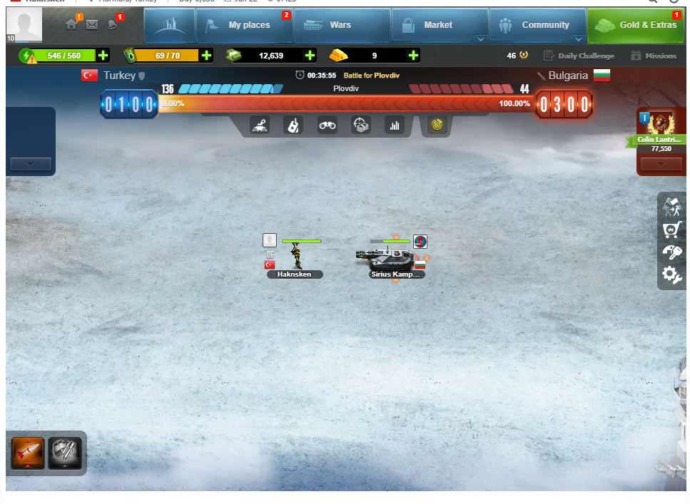
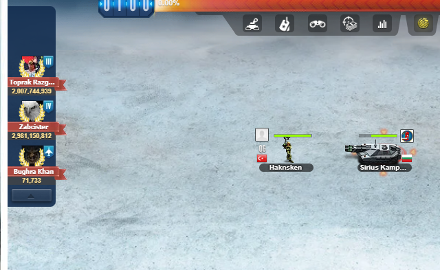
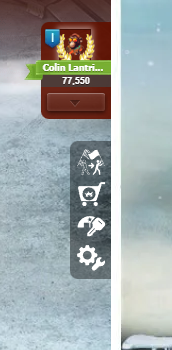
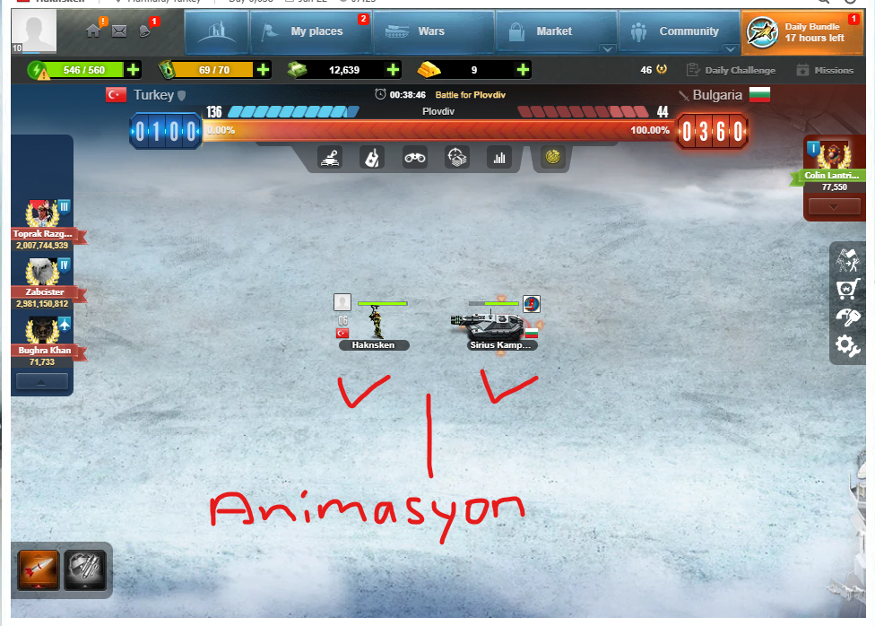
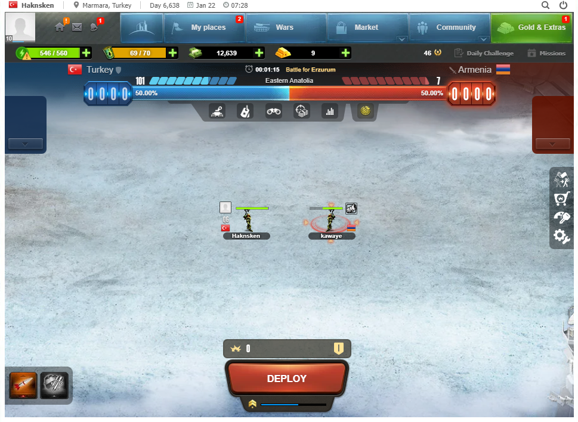
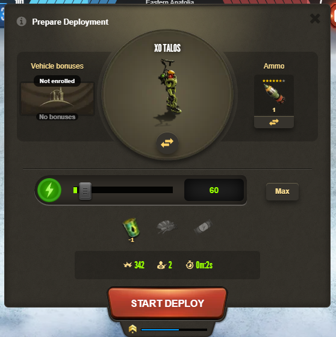
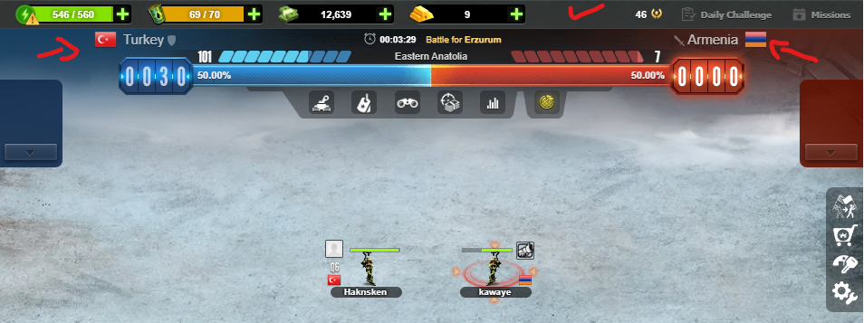

Simdi dün battle backend bitirdik, ve bazi UI eklemeler yaptik. wars sayfasi aktif savaslar vs gayet basarili. 

simdi senden beklentim;

http://localhost:3000/wars/1

aktif savaslar modülünde savasmak icin tasarladigimiz panel yapisi erepublik varii. Bu güzel ama iyilestirmeler gerekli.

 Bu görselde oldugu gibi savas modülü fix background image üzerine kurulu basit animasyonlarla destekli modal olmali. 

solda A ülke sagda B ülke.

en üst bar savas bar durumu. Solda acilir box aktif en güclü hasar hero gösterimi. sagda aynisi. örnek görseller hero icin!

Merkezde 2 ülkenin aktif hasar veren askerlerinin bilgileri ile beraber basit animasyonu. 

A ülkesinin askeri hasar verdiyse onchain veri cekilir ve animasyon tekrar edecek sekilde döner. örnek görsel: 

 Bu görselde oldugu gibi vurmak icin deploy butonu. (Bizim UI de suan var iyilestirilebilir.)

Bu ekstra modal acar ve kullanici vurmak icin silah secer ve kac bar enerji tüketimini ayarlar. (Akilli sözlesmede batch battle fight olmali. sürekli her 10 enerji icin confirm ekrani geliyor.).

 deploy sonrasi acilan modal panel bu görsele benzer tasarlanmali.

 üst panelde aktif savasan ülke ID bayraklari olmali.

ve Profil enerji durumu ve balance durumu. 

/public/image/Wars-background klasöründe arkaplanda kullanacagin savas sahneleri var.

Bunlari kullanabilirsin.

Ayrica animasyonlar icin sana piyada görsel birakiyorum icon klasöründe army.png isminde 2 tane var.

Bunlarida animasyon olarak döndürecegiz. sadece etrafinda sacmalar,ates efekti olsun. görsel hafif ileri geri cok hafif.

bu beklentiler dahilinde tüm planlamani yap. 

web3 akilli kontrat entegrasyonunuda dikkatli yap. suan entegre hepsi ama UI tasarlarken bunuda unutma.

